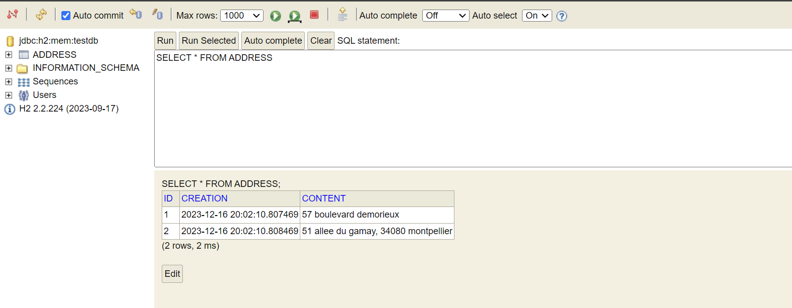
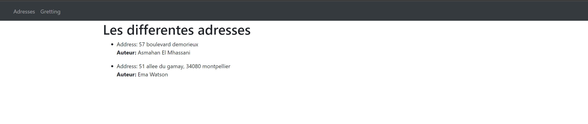

# TP3

TP3 (Lien github : https://github.com/Asmahan355/TP3_API_OUTILLAGE)
## Dependencies

### 1. Web
- **Description**: The Web dependency is used for developing web applications using Spring MVC. It provides features for handling HTTP requests, managing templates, and implementing other aspects related to web development.

### 2. JPA (Java Persistence API)
- **Description**: JPA is a Java API for managing data persistence. It simplifies the interaction between a Java application and a relational database by providing an object model for data representation.

### 3. Hibernate
- **Description**: Hibernate is a persistence framework that implements JPA. It facilitates object-relational mapping (ORM), enabling the storage and retrieval of Java objects in a relational database.

### 4. H2
- **Description**: H2 is an in-memory relational database written in Java. It is commonly used for development and testing due to its lightweight nature and ease of use.

### 5. DevTools
- **Description**: DevTools provides development features such as automatic application restart on code changes, live reloading of resources, and other enhancements to speed up the development cycle.

### 6. Thymeleaf
- **Description**: Thymeleaf is a template engine for Java-based Spring applications. It allows for elegant HTML template creation by integrating expressions directly into the HTML code. Thymeleaf is commonly used for generating web pages in Spring projects.

## Getting Started


#Etape 13 : reponse question 
###1 Paramétrage de l'URL d'appel (/greeting):

La partie du code qui paramètre l'URL d'appel est l'annotation @GetMapping("/greeting"). Cette annotation indique que la méthode greeting doit être déclenchée lorsqu'une requête GET est effectuée sur l'URL /greeting.

###2 Choix du fichier HTML à afficher:

Le choix du fichier HTML à afficher se fait à travers la déclaration return "greeting"; à la fin de la méthode greeting. Dans ce cas, la chaîne "greeting" est renvoyée, et Spring Boot interprète cela comme la recherche d'un fichier HTML avec le nom "greeting" pour afficher la vue correspondante.
###3 Envoi du nom à qui nous disons bonjour avec le second lien:
Le nom à qui nous disons bonjour est envoyé à la vue (fichier HTML) via le modèle (Model model). Plus précisément, la ligne model.addAttribute("nomTemplate", nameGET); ajoute l'attribut "nomTemplate" au modèle, avec la valeur du paramètre nameGET. Cet attribut sera accessible dans le fichier HTML associé, et vous pouvez l'afficher en utilisant l'expression Thymeleaf correspondante.


#Etape 17 : Mise à jour de la Base de Données

Suite à l'ajout de la classe `Address` avec les annotations JPA, une nouvelle table a été générée dans la base de données H2. Lorsque l'application est relancée, Hibernate, en collaboration avec JPA, détecte les entités marquées avec `@Entity` et crée automatiquement les tables correspondantes dans la base de données. on peut observer cette nouvelle table dans la console H2 à l'adresse http://localhost:8080/h2-console.

La structure de la table est déterminée par les annotations telles que `@Id` et `@GeneratedValue` utilisées dans la classe `Address`. Ces annotations indiquent que la propriété `id` de la classe est la clé primaire et que sa valeur doit être générée automatiquement.

#Etape 20 : Aprés l'ajout de fichier data.sql
Suite à l'ajout du fichier data.sql, on peut observer dans la console H2 les données de la base lorsqu'on effectue une requête SELECT.


#Etape 21: Autowired 
L'annotation @Autowired est utilisée en Spring Framework pour effectuer une injection de dépendances automatique. Elle permet à Spring de résoudre et d'injecter automatiquement les dépendances requises par une classe. Cela facilite le couplage lâche des composants de l'application en permettant à Spring de gérer les dépendances entre les classes.


#Etape 29 et 30  : Ajouter Bootstrap 

dans pom.xml on ajout cette dependance 
``` 
<dependency>
    <groupId>org.webjars</groupId>
    <artifactId>bootstrap</artifactId>
    <version>5.7.0</version> 
</dependency>
```

ici on utilise la version 4 du bootstrap

en suite j'ai ajoute une classe de configuration pour configuer 
spring a utiliser cette libraire , cette classe est dans le package 
config que j'ai creé : 
```bash
@Configuration
@EnableWebMvc
public class WebConfig implements WebMvcConfigurer {

    @Override
    public void addResourceHandlers(ResourceHandlerRegistry registry) {
        registry
          .addResourceHandler("/webjars/**")
          .addResourceLocations("/webjars/");
    }
}
```
et pour utiliser bootsrap dans ma page html nav j'ai ajouté ceci :

``` 
     <script src="/webjars/bootstrap/4.3.1/js/bootstrap.min.js"></script>
  <link rel="stylesheet" href="/webjars/bootstrap/4.3.1/css/bootstrap.min.css" />
```

pour tester si ca marche our pas on utilise des classe bootstrap 
comme class ='container'  


apres l'ajout de bootstrap  :


